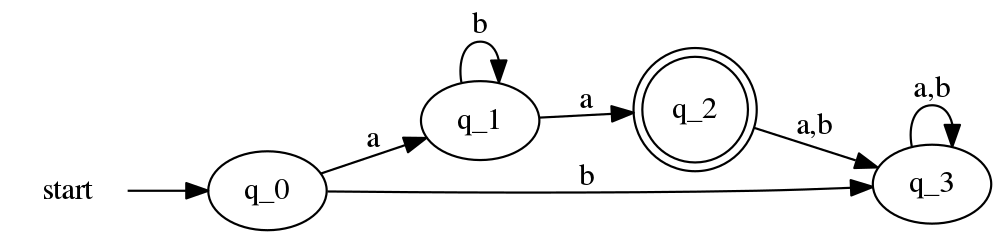
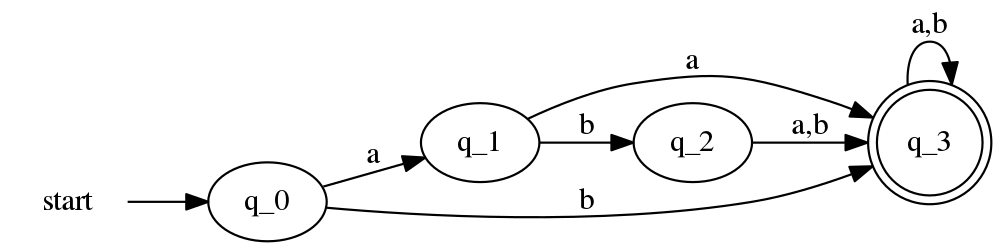
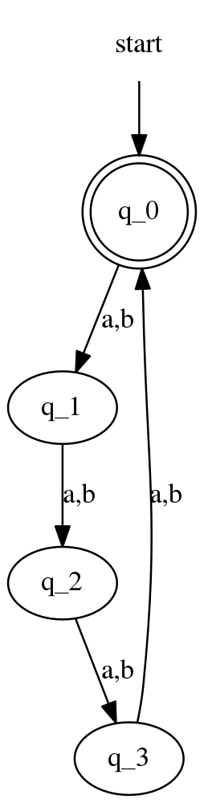

# Automata

A simple C implementation of finite automata

## Installation

```bash
$ mkdir build && cd build
$ cmake .. && make && make install
```

## Usage

```bash
$ automata file.aut --run # Read input from STDIN and determine if it is accepted
$ automata file.aut --graph > out.gv # Output the automaton to a DOT graph
```

## Dependence

It uses following open Source Library.

1. libconfig - https://hyperrealm.github.io/libconfig/ 

## Sample Output

### [Example 1](./examples/example1.aut)


### [Example 2](./examples/example2.aut)



### [Example 3](./examples/example3.aut)



### [Example 4](./examples/example4.aut)



## Contributing

1. Smash:facepunch::facepunch::facepunch: that mf fork:fork_and_knife: button:weary::100::100:
2. Create your feature branch: `git checkout -b my-new-feature`
3. Commit your changes: `git commit -am 'Add some feature'`
4. Push to the branch: `git push origin my-new-feature`
5. Submit a pull request

## License

See [the license file](LICENSE).
